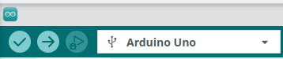
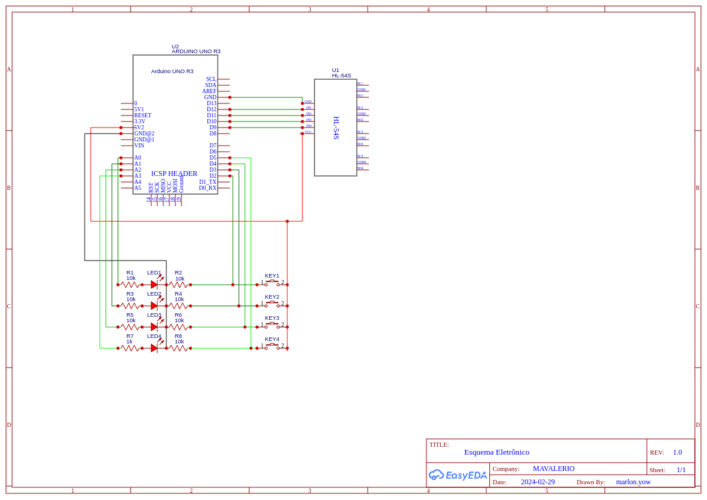
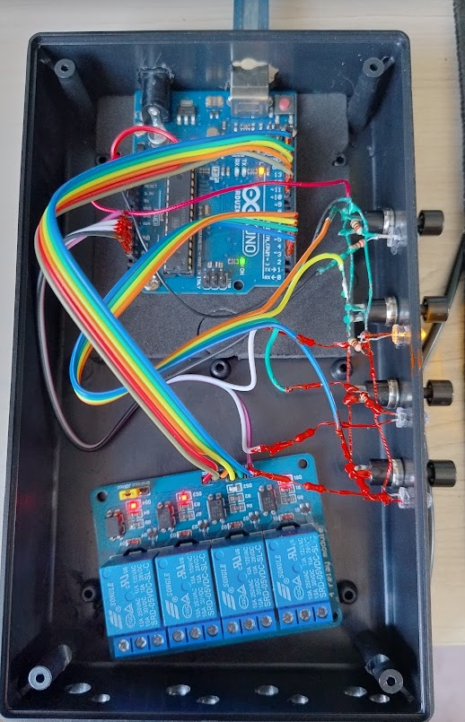

<!-- Improved compatibility of back to top link: See: https://github.com/othneildrew/Best-README-Template/pull/73 -->

<!-- PROJECT SHIELDS -->
<!--
*** I'm using markdown "reference style" links for readability.
*** Reference links are enclosed in brackets [ ] instead of parentheses ( ).
*** See the bottom of this document for the declaration of the reference variables
*** for contributors-url, forks-url, etc. This is an optional, concise syntax you may use.
*** https://www.markdownguide.org/basic-syntax/#reference-style-links
-->
[![Contributors][contributors-shield]][contributors-url]
[![Forks][forks-shield]][forks-url]
[![Stargazers][stars-shield]][stars-url]
[![Issues][issues-shield]][issues-url]
[![GPL3 License][license-shield]][license-url]

<!-- PROJECT LOGO -->
 

    
    <h3 align="center">Projeto Exaustor Automágico</h3>
        

            Fazer um controlador dos exaustores das 4 chaminés.
        

     
    <b>Premissas:</b>
    <ul align='left'>
        <li>ligar com um toque</li>
        <li>desligar com um segundo toque</li>
        <li>desligar sozinho depois de 4 horas se não desligarem antes</li>
        <li>as 4 chaminés serem independentes</li>
    </ul>

<!-- TABLE OF CONTENTS -->

    
Table of Contents

    <ol>
        <li>
            <a href="#about-the-project">Sobre o Projeto</a>
            <ul>
                <li><a href="#built-with">Feito com</a></li>
            </ul>
        </li>
        <li>
            <a href="#getting-started">Por onde começar</a>
            <ul>
                <li><a href="#prerequisites">Prerequisitos</a></li>
                <li><a href="#installation">Instalação</a></li>
            </ul>
        </li>
        <li><a href="#usage">Uso</a></li>
        <li><a href="#roadmap">Roadmap</a></li>
        <li><a href="#contributing">Contributing</a></li>
        <li><a href="#license">Licença</a></li>
        <li><a href="#contact">Contato</a></li>
    </ol>

<!-- ABOUT THE PROJECT -->
## Sobre o Projeto

Projeto interno para resolver um problema no condomínio. Precisa ligar para não sair fumaça no lugar errado, e não pode ficar ligado pois o barulho incomoda e gasta luz.

(<a href="#readme-top">back to top</a>)

### Feito com

* [![Arduino][Arduino]][Arduino-url]

(<a href="#readme-top">back to top</a>)

<!-- GETTING STARTED -->
## Por onde começar

### Prerequisitos
Sugiro começar com uma Protoboard  

Tenha algum material em mãos:

|Item |Valor U |Qtd |Valor T|Link|
|-----|--------|----|-------|----|
|LED Difuso 5mm Amarelo|R$ 0,25|4|R$ 1,00|https://www.baudaeletronica.com.br/produto/led-de-alto-brilho-3mm-amarelo.html|
|Resistor 220R 5% (1/4W)"|R$ 0,08|8|R$ 0,64|https://www.baudaeletronica.com.br/produto/resistor-220r-5-14w.html|
|Arduino Uno R3 Cabo USB 2.0 - A-B|R$ 88,90|1|R$ 88,90|https://www.baudaeletronica.com.br/produto/arduino-uno-r3.html|
Fonte Bivolt 12V 2A|R$ 15,90|1|R$ 15,90|https://www.baudaeletronica.com.br/produto/fonte-bivolt-12v-1a.html|
Módulo Relé 4 Canais (HL-54S V1.0)|R$ 25,00|1|R$ 25,00|https://www.betacomercial.com.br/loja/produto/shield-modulo-rele-5v-4-canais|
Botões (chave pushbutton N.A. S/Retencao 1A preta)|R$ 7,68|4|R$ 30,72|https://www.betacomercial.com.br/loja/produto/chave-pushbutton-n-a-s-retencao-1a-preta|
Caixa Plastica (PB 119/3)|R$ 32,12|1|R$ 32,12|https://www.betacomercial.com.br/loja/produto/caixa-plastica-pb119-3-36-x-112-x-190|
Barra de pino 1x40 180 graus|R$ 2,00|1|R$ 2,00|https://www.betacomercial.com.br/loja/produto/barra-de-pino-1x40-180-graus|
||||
|TOTAL||21|R$ 196,28|

### Installation
Programa pra fazer as coisas no Arduino fica no site oficial

* [![Arduino][Arduino]][Arduino-IDE-url]

Conecta o cabo USB, e clica nos 2 primeiros botões: Check e Flecha

Monta aí esse rolê (não tenho certeza se está certo, meu especialista vai revisar)

depois solda os componentes e dispõe como melhor achar

(<a href="#readme-top">back to top</a>)

<!-- USAGE EXAMPLES -->
## Uso

Bom, são 4 relés!
* Não precisa ser 4 horas é só trocar a programação e salvar no chip via cabo usb.
* Não precisa ser usado somente para Exaustor, qualquer eletro-eletrônico que comece a funcionar quando liga na tomada e
não "sofra" se você desligar ele da tomada direto.

(<a href="#readme-top">back to top</a>)

<!-- ROADMAP -->
## Roadmap

- Bom, é a primeira versão, não testamos em produção ainda
- Não temos nenhuma proposta de melhoria ainda

Hmmm, se quiser olhar [issues](https://github.com/marlon-yow/exaustor/issues).

(<a href="#readme-top">back to top</a>)

<!-- CONTRIBUTING -->
## Contributing

Contributions are what make the open source community such an amazing place to learn, inspire, and create. Any contributions you make are **greatly appreciated**.

If you have a suggestion that would make this better, please fork the repo and create a pull request. You can also simply open an issue with the tag "enhancement".
Don't forget to give the project a star! Thanks again!

1. Fork the Project
2. Create your Feature Branch (`git checkout -b feature/AmazingFeature`)
3. Commit your Changes (`git commit -m 'Add some AmazingFeature'`)
4. Push to the Branch (`git push origin feature/AmazingFeature`)
5. Open a Pull Request

(<a href="#readme-top">back to top</a>)

<!-- LICENSE -->
## Licença

 GPL3 `gpl-3.0.txt`

(<a href="#readme-top">back to top</a>)

<!-- CONTACT -->
## Contato

Mavalerio - [@instagram_handle](https://www.instagram.com/mar_gyver) - marlon_yow[at]gmail[dot]com

Project Link: [https://github.com/marlon-yow/exaustor](https://github.com/marlon-yow/exaustor)

(<a href="#readme-top">back to top</a>)

<!-- MARKDOWN LINKS & IMAGES -->
<!-- https://www.markdownguide.org/basic-syntax/#reference-style-links -->
[contributors-shield]: https://img.shields.io/github/contributors/marlon-yow/exaustor.svg?style=for-the-badge
[contributors-url]: https://github.com/marlon-yow/exaustor/graphs/contributors
[forks-shield]: https://img.shields.io/github/forks/marlon-yow/exaustor.svg?style=for-the-badge
[forks-url]: https://github.com/marlon-yow/exaustor/network/members
[stars-shield]: https://img.shields.io/github/stars/marlon-yow/exaustor.svg?style=for-the-badge
[stars-url]: https://github.com/marlon-yow/exaustor/stargazers
[issues-shield]: https://img.shields.io/github/issues/marlon-yow/exaustor.svg?style=for-the-badge
[issues-url]: https://github.com/marlon-yow/exaustor/issues
[license-shield]: https://img.shields.io/github/license/marlon-yow/exaustor.svg?style=for-the-badge
[license-url]: https://github.com/marlon-yow/exaustor/blob/master/gpl-3.0.txt
[product-screenshot]: images/screenshot.png
[Arduio]: https://img.shields.io/badge/Arduino-00878F?style=for-the-badge&logo=arduino&logoColor=white
[Arduino-url]: https://docs.arduino.cc/
[Arduino-IDE-url]: https://docs.arduino.cc/software/ide-v2/tutorials/getting-started-ide-v2/